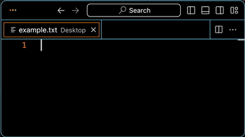
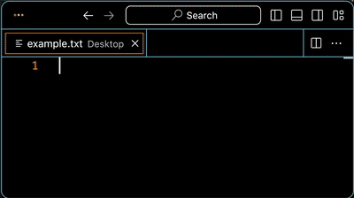
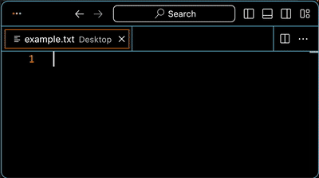
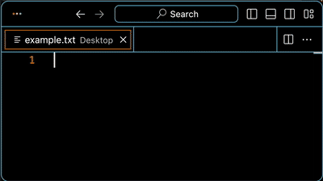
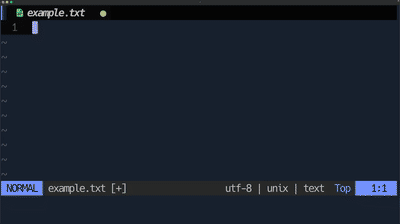
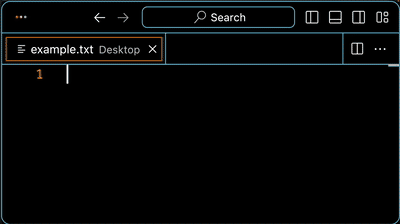
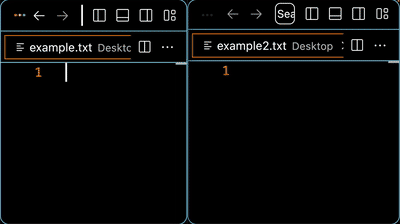

# AutoTyper For Mac

This app automatically types the contents of
a text script into an app. It's goal is to make it
easier to make screen recordings where typing
is necessary. Instead of doing it manually, 
the app will do it for you. Faster and without 
flubbing keys. 

You can [check out an intro video here](http://www.youtube.com/watch?v=VrT6AG_jMwE):

## Installation

- Download the AutoTyper-v#.#.#.zip file. Unzip it
and copy the AutoTyper.app file to your
Applications folder. 

## Usage

1. Create a .txt file with instructions in it (the full list of
available instructions is in the Instructions sections further below).

2. Use the 'Choose Instructions File' button to select your script file.

3. Click on the app you want to output the script to in the 'Select App' section.

4. Click 'Run'. You may be asked to allow the app permissions in the System Preferences. This is required to let AutoTyper simulate a keyboard to do that actual typing. (Note that sometimes you have to delete the AutoTyper item, click Run, and turn it back on to reset it.)

## Examples

Here are a few scripts to get you started. 

### Hello, World

<table>
    <tr>
        <td><pre><code>type: Hello, World!</code></pre></td>
        <td></td>
    </tr>
</table>

---

### Multiple Lines

<table>
    <tr>
        <td><pre><code>type-line: Hello, 
type: World!</code></pre></td>
        <td></td>
    </tr>
</table>

---

### Type, Pause, Type

<table>
    <tr>
        <td><pre><code>type: Hello,
pause
press: space
type: World!</code></pre></td>
        <td></td>
    </tr>
</table>

Note: the `pause` waits for you to press `F4` at which point
it types a space followed by `World!`.

---

### Type A Block Of Text

<table>
    <tr>
        <td><pre><code>start-lines
Lorem ipsum dolor 
adipiscing elit. 
posuere ut volutpat.
  
Suspendisse euismod 
id malesuada. 
Proin id aliquet.
end-lines</code></pre></td>
        <td></td>
    </tr>
</table>

Outputs the block of text between `start-lines`
and `end-lines`

---

### Type, Select, Overwrite In VS Code

<table>
    <tr>
        <td><pre><code>type: alfa, bravo, charlie
pause: 0.8
repeat: 2: option: left-arrow
press: option: shift: right-arrow
pause: 0.8
type: DELTA</code></pre></td>
        <td></td>
    </tr>
</table>

This example types:

`alfa, bravo, charlie`

then selects `bravo` and overwrites it with `DELTA`. 
Pauses are added in to make it easier to see
what's going on. 

This works in apps like VS Code where `option + left/right-arrow`
jumps words and `option + shift + left/right-arrow` selects
words. 

---

### Type, Select, Overwrite In Neovim

<table>
    <tr>
        <td><pre><code>press: escape
type: i
type: alfa, bravo, charlie
pause: 0.8
press: escape
type: 3bdwi
type: DELTA</code></pre></td>
        <td></td>
    </tr>
</table>

Presses `escape` to make sure you're not already in 
`INSERT` mode then `i` to switch to it. Next, it
types `alfa, bravo, charlie` then pause before
pressing `escape` again to switch to `NORMAL` mode
and typing in the commands to back up 3 time, delete
the word and switch back to `INSERT` mode before
typing `DELTA`

---

### Paste Contents Of A File

<table>
    <tr>
        <td><pre><code>paste-file-lines: /Users/alan/Desktop/sample.txt</code></pre></td>
        <td></td>
    </tr>
</table>

---

### Jump Between Windows

AutoTyper only types into one app at a time, but you can
jump between windows in apps like VS Code by using
`press: command: ~`

<table>
    <tr>
        <td><pre><code>type: Window 1
press: command: ~
pause: 0.4
type: Window 2</code></pre></td>
        <td></td>
    </tr>
</table>

Note that adding a `pause: 0.1` or more is recommended to make sure
the app has enough time to switch the window before typing continues. 

## General Notes

- The basic ways to type are `type: TEXT`, `type-line: TEXT`, 
and `type-down:TEXT`. For example:

    `type: Hello, World`

    `type-line: Hello, World`

    `type-down: Hello, World`

- The `type: TEXT` instruction doesn't add a `return/enter` after it finishes typing.
(That it, it only types in the characters from your `TEXT`)

- `type-line: TEXT` presses `return/enter` after typing your `TEXT`

- `type-down: TEXT` presses the down arrow after typing your `TEXT`

- The `press: KEY` instruction is used for pressing a specific `KEY`. (The 
full list of available keys is in the Keys section further below)

- The `press: MODIFIER: KEY` instruction holds the specific `MODIFIER`
while pressing the `KEY`. For example:

    `press: command: a`

- Multiple `MODIFIER` keys can be held while pressing a key like:

    `press: option: shift: right-arrow`

- The `pause` instruction pauses typing until you press `F4` on your
keyboard. This is the main thing I use to create breaks for 
talking when I'm doing scree recordings. 

- The `pause: TIME` instruction pauses for the specified time 
(measured in seconds). I generally use this for little pauses 
(e.g. `pause: 0.3`) to make it easier to track when I do thing
like highlight and delete code.

## Instructions

This is the list of available instructions

<table>
    <thead>
        <tr>
            <th>Instruction</th>
            <th colspan="2">Description</th>
        </tr>
    </thead>
    <tbody>
        <!-- ITEM -->
        <tr>
            <td rowspan="2" valign="top" width="240">debug: on</td>
            <td colspan="2" valign="top">

Remove all delays and pauses to fast-forward until <code>debug: off</code> or the end of the script.  

            </td>
        </tr>
        <tr>
            <td valign="top">Usage</td>
            <td valign="top"><pre><code>debug: on</code></pre></td>
        </tr>
        <!-- ITEM -->
        <tr>
            <td rowspan="2" valign="top">debug: off</td>
            <td colspan="2" valign="top">

Restores all pauses so the instruction runs with their specified delays and pauses.  

            </td>
        </tr>
        <tr>
            <td valign="top">Usage</td>
            <td valign="top"><pre><code>debug: off</code></pre></td>
        </tr>
        <!-- ITEM -->
        <tr>
            <td rowspan="2" valign="top">down</td>
            <td colspan="2" valign="top">

Press the down arrow key one time.  

            </td>
        </tr>
        <tr>
            <td valign="top">Usage</td>
            <td valign="top"><pre><code>down</code></pre></td>
        </tr>
        <!-- ITEM -->
        <tr>
            <td rowspan="2" valign="top">down: NUMBER</td>
            <td colspan="2" valign="top">

Presses the down arrow key the specified NUMBER of times.  

            </td>
        </tr>
        <tr>
            <td valign="top">Usage</td>
            <td valign="top"><pre><code>down: 3</code></pre></td>
        </tr>
        <!-- ITEM -->
        <tr>
            <td rowspan="2" valign="top">end-lines</td>
            <td colspan="2" valign="top">

Ends capturing lines that will be pasted via 'command + v' one at a time followed by pressing 'return' to move to a new line.

The capture is started with 'start-lines'.  

            </td>
        </tr>
        <tr>
            <td valign="top">Example</td>
            <td valign="top"><pre><code>start-lines
Lorem ipsum dolor sit amet, consectetur 
adipiscing elit. 
 
 
Curabitur dignissim pretium justo nec 
tincidunt. 
end-lines</code></pre></td>
        </tr>
        <!-- ITEM -->
        <tr>
            <td rowspan="2" valign="top">end-lines-down</td>
            <td colspan="2" valign="top">

Ends capturing lines that will be pasted via 'command + v' one at a time followed by pressing the down arrow.

The capture is started with 'start-lines-down'.  

            </td>
        </tr>
        <tr>
            <td valign="top">Example</td>
            <td valign="top"><pre><code>start-lines-down
Lorem ipsum dolor sit amet, consectetur 
adipiscing elit. 
 
 
Curabitur dignissim pretium justo nec 
tincidunt. 
end-lines-down</code></pre></td>
        </tr>
        <!-- ITEM -->
        <tr>
            <td rowspan="2" valign="top">left</td>
            <td colspan="2" valign="top">

Presses the left arrow key one time.  

            </td>
        </tr>
        <tr>
            <td valign="top">Usage</td>
            <td valign="top"><pre><code>left</code></pre></td>
        </tr>
        <!-- ITEM -->
        <tr>
            <td rowspan="2" valign="top">left: Number</td>
            <td colspan="2" valign="top">

Presses the left arrow key the specified NUMBER of times.  

            </td>
        </tr>
        <tr>
            <td valign="top">Usage</td>
            <td valign="top"><pre><code>left: 3</code></pre></td>
        </tr>
        <!-- ITEM -->
        <tr>
            <td rowspan="2" valign="top">paste: TEXT</td>
            <td colspan="2" valign="top">

Pastes the TEXT by pressing 'command + v'.   

            </td>
        </tr>
        <tr>
            <td valign="top">Usage</td>
            <td valign="top"><pre><code>paste: The quick brown fox</code></pre></td>
        </tr>
        <!-- ITEM -->
        <tr>
            <td rowspan="2" valign="top">paste-down: TEXT</td>
            <td colspan="2" valign="top">

Pastes the TEXT by pressing 'command + v' then presses the down arrow.  

            </td>
        </tr>
        <tr>
            <td valign="top">Usage</td>
            <td valign="top"><pre><code>paste-down: The quick brown fox</code></pre></td>
        </tr>
        <!-- ITEM -->
        <tr>
            <td rowspan="2" valign="top">paste-line: TEXT</td>
            <td colspan="2" valign="top">

Pastes the TEXT by pressing 'command + v' then presses the return key to move to the next line.   

            </td>
        </tr>
        <tr>
            <td valign="top">Usage</td>
            <td valign="top"><pre><code>paste-line: The quick brown fox</code></pre></td>
        </tr>
        <!-- ITEM -->
        <tr>
            <td rowspan="2" valign="top">paste-file: PATH</td>
            <td colspan="2" valign="top">

Pastes the contents of the file at the given PATH by pressing 'command + v'.

Note: You can get the PATH for a file by right clicking on it in the Finder then holding the 'option' key. When you do, the 'Copy' menu item will turn into 'Copy ... as Pathname' which is what PATH uses.   

            </td>
        </tr>
        <tr>
            <td valign="top">Example</td>
            <td valign="top"><pre><code>paste-file: /Users/alan/example.txt</code></pre></td>
        </tr>
        <!-- ITEM -->
        <tr>
            <td rowspan="2" valign="top">paste-file-lines: PATH</td>
            <td colspan="2" valign="top">

Pastes the contents of the file at the given PATH. Each line in the file is pasted individually via 'command + v'. The 'return' key is pressed after each line is pasted to move to the next line. 

Note: You can get the PATH for a file by right clicking on it in the Finder then holding the 'option' key. When you do, the 'Copy' menu item will turn into 'Copy ... as Pathname' which is what PATH uses.  

            </td>
        </tr>
        <tr>
            <td valign="top">Example</td>
            <td valign="top"><pre><code>paste-file-lines: /Users/alan/example.txt</code></pre></td>
        </tr>
        <!-- ITEM -->
        <tr>
            <td rowspan="2" valign="top">paste-file-lines-down: PATH</td>
            <td colspan="2" valign="top">

Pastes the contents of the file at the given PATH. Each line in the file is pasted individually via 'command + v'. The down arrow is pressed after each line is pasted to move to the next line. 

Note: You can get the PATH for a file by right clicking on it in the Finder then holding the 'option' key. When you do, the 'Copy' menu item will turn into 'Copy ... as Pathname' which is what PATH uses.   

            </td>
        </tr>
        <tr>
            <td valign="top">Example</td>
            <td valign="top"><pre><code>paste-file-lines-down: /Users/alan/example.txt</code></pre></td>
        </tr>
        <!-- ITEM -->
        <tr>
            <td rowspan="2" valign="top">pause</td>
            <td colspan="2" valign="top">

Pauses typing until F4 is pressed on the keyboard.   

            </td>
        </tr>
        <tr>
            <td valign="top">Usage</td>
            <td valign="top"><pre><code>pause</code></pre></td>
        </tr>
        <!-- ITEM -->
        <tr>
            <td rowspan="2" valign="top">pause: TIME</td>
            <td colspan="2" valign="top">

Pauses typing for the given amount of TIME which is measured in seconds.   

            </td>
        </tr>
        <tr>
            <td valign="top">Examples</td>
            <td valign="top"><pre><code>pause: 1
pause: 1.2
pause: 0.3</code></pre></td>
        </tr>
        <!-- ITEM -->
        <tr>
            <td rowspan="2" valign="top">press: KEY</td>
            <td colspan="2" valign="top">

Presses the given KEY one time.

Note: Only lower case letters can be used with 'press:'. Use 'press: shift: KEY' to make them upper case.

Note: The list of available keys is listed in the Keys section below.  

            </td>
        </tr>
        <tr>
            <td valign="top">Examples</td>
            <td valign="top"><pre><code>press: a
press: space
press: right-arrow</code></pre></td>
        </tr>
        <!-- ITEM -->
        <tr>
            <td rowspan="2" valign="top">press: MODIFIERS: KEY</td>
            <td colspan="2" valign="top">

Press the given KEY one time while holding down the MODIFIERS.

The MODIFIERS are:

<ul>
    <li>command</li>
    <li>control</li>
    <li>option</li>
    <li>shift</li>
</ul>

One or more MODIFIERS can be used at a time.

Note: Only lower case letters can be used with 'press:'. Use 'press: shift: KEY' to make them upper case.

Note: The list of available keys is listed in the Keys section below.  

            </td>
        </tr>
        <tr>
            <td valign="top">Examples</td>
            <td valign="top"><pre><code>press: command: a
press: option: right-arrow
press: option: shift: right-arrow</code></pre></td>
        </tr>
        <!-- ITEM -->
        <tr>
            <td rowspan="2" valign="top">repeat: KEY</td>
            <td colspan="2" valign="top">

Presses the KEY the specified NUMBER of times.

Note: Only lower case letters can be used with 'repeat:'. Use 'repeat: shift: KEY' to make them upper case.

Note: The list of available keys is listed in the Keys section below.  

            </td>
        </tr>
        <tr>
            <td valign="top">Examples</td>
            <td valign="top"><pre><code>repeat: 3: space
repeat: 3: up-arrow</code></pre></td>
        </tr>
        <!-- ITEM -->
        <tr>
            <td rowspan="2" valign="top">repeat: MODIFIERS: KEY</td>
            <td colspan="2" valign="top">

Press the given KEY the specified NUMBER of times while holding down the MODIFIERS.

The MODIFIERS are:

<ul>
    <li>command</li>
    <li>control</li>
    <li>option</li>
    <li>shift</li>
</ul>

One or more MODIFIERS can be used at a time.

Note: Only lower case letters can be used with 'repeat:'. Use 'repeat: shift: KEY' to make them upper case.

Note: The list of available keys is listed in the Keys section below.  

            </td>
        </tr>
        <tr>
            <td valign="top">Usage</td>
            <td valign="top"><pre><code>repeat: 3: shift: a
repeat: 5: option: right-arrow
repeat: 2: option: shift: right-arrow</code></pre></td>
        </tr>
        <!-- ITEM -->
        <tr>
            <td rowspan="2" valign="top">reset-delay</td>
            <td colspan="2" valign="top">

Resets the minimum and maximum times that the random delay between key presses uses to their default values.   

            </td>
        </tr>
        <tr>
            <td valign="top">Usage</td>
            <td valign="top"><pre><code>reset-delay</code></pre></td>
        </tr>
        <!-- ITEM -->
        <tr>
            <td rowspan="2" valign="top">return</td>
            <td colspan="2" valign="top">

Presses the 'return' key one time.  

            </td>
        </tr>
        <tr>
            <td valign="top">Usage</td>
            <td valign="top"><pre><code>return</code></pre></td>
        </tr>
        <!-- ITEM -->
        <tr>
            <td rowspan="2" valign="top">return: NUMBER</td>
            <td colspan="2" valign="top">

Presses the 'return' key the specified NUMBER of times.   

            </td>
        </tr>
        <tr>
            <td valign="top">Example</td>
            <td valign="top"><pre><code>return: 3</code></pre></td>
        </tr>
        <!-- ITEM -->
        <tr>
            <td rowspan="2" valign="top">right</td>
            <td colspan="2" valign="top">

Presses the right arrow key one time.  

            </td>
        </tr>
        <tr>
            <td valign="top">Usage</td>
            <td valign="top"><pre><code>right</code></pre></td>
        </tr>
        <!-- ITEM -->
        <tr>
            <td rowspan="2" valign="top">right: NUMBER</td>
            <td colspan="2" valign="top">

Presses the right arrow key the specified NUMBER of times.  

            </td>
        </tr>
        <tr>
            <td valign="top">Example</td>
            <td valign="top"><pre><code>right: 3</code></pre></td>
        </tr>
        <!-- ITEM -->
        <tr>
            <td rowspan="2" valign="top">set-delay: TIME</td>
            <td colspan="2" valign="top">

Sets the delay between key presses to TIME which is measured in seconds.   

            </td>
        </tr>
        <tr>
            <td valign="top">Example</td>
            <td valign="top"><pre><code>set-delay: 0.04</code></pre></td>
        </tr>
        <!-- ITEM -->
        <tr>
            <td rowspan="2" valign="top">set-delay: MIN: MAX</td>
            <td colspan="2" valign="top">

Resets the minimum and maximum times that the random delay between key presses uses to MIN_TIME and MAX_TIME, respectively.  

            </td>
        </tr>
        <tr>
            <td valign="top">Example</td>
            <td valign="top"><pre><code>set-delay: 0.05: 0.1</code></pre></td>
        </tr>
    </tbody>
</table>

<table>
    <thead>
        <tr>
            <th>Instruction</th>
            <th>Description</th>
        </tr>
    </thead>
    <tbody>

<tr><td>space</td><td>
Presses the 'space' key one time.
 

 
~ Usage ~
 

 
space
 
</td></tr>
<tr><td>space: NUMBER</td><td>
Presses the 'space' key the specified NUMBER of times. 
 

 
~ Example ~
 

 
space: 3
 
</td></tr>
<tr><td>start-lines</td><td>
Starts capturing lines that will be pasted via 'command + v' one at a time followed by pressing 'return' to move to a new line. 
 

 
The capture continues until an 'end-lines' instruction is found. 
 

 
~ Example ~
 

 
start-lines
 
Lorem ipsum dolor sit amet, consectetur 
 
adipiscing elit. 
 

 
Curabitur dignissim pretium justo nec 
 
tincidunt. 
 
end-lines
 
</td></tr>
<tr><td>start-lines-down</td><td>
Starts capturing lines that will be pasted via 'command + v' one at a time followed by pressing the down arrow. 
 

 
The capture continues until an 'end-lines-down' instruction is found. 
 

 
~ Example ~
 

 
start-lines-down
 
Lorem ipsum dolor sit amet, consectetur 
 
adipiscing elit. 
 

 
Curabitur dignissim pretium justo nec 
 
tincidunt. 
 
end-lines-down
 
</td></tr>
<tr><td>stop</td><td>
Stops the script from running.
 
</td></tr>
<tr><td>tab</td><td>
Presses the 'tab' key one time.
 

 
~ Usage ~
 

 
tab
 
</td></tr>
<tr><td>tab: NUMBER</td><td>
Presses the 'tab' key the specified NUMBER of times. 
 

 
~ Example ~
 

 
tab: 3
 
</td></tr>
<tr><td>type: TEXT</td><td>
Types the given TEXT
 

 
~ Example ~
 

 
type: The quick brown fox
 

 
~ Notes ~
 

 
- Neither the 'return' key or down-arrow is presses after the TEXT is types. This provides as way to edit text in the middle of a line without making or moving to a new line. 
 

 
- Any spaces at the start of the TEXT are removed.
 

 
- Any spaces at the end of the TEXT are removed.
 

 
- Use a 'press: space' instruction to add spaces at either the start or the end of a piece of text if necessary. 
 
</td></tr>
<tr><td>type-down: TEXT</td><td>
Types the given TEXT followed by pressing the down arrow key. 
 

 
~ Example ~
 

 
type-down: The quick brown fox
 

 
~ Notes ~
 

 
- Any spaces at the start of the TEXT are removed.
 

 
- Any spaces at the end of the TEXT are removed.
 

 
- Use a 'press: space' instruction to add spaces at either the start or the end of a piece of text if necessary. 
 
</td></tr>
<tr><td>type-line: TEXT</td><td>
Types the given TEXT followed by pressing the 'return' key. 
 

 
~ Example ~
 

 
type-line: The quick brown fox
 

 
~ Notes ~
 

 
- Any spaces at the start of the TEXT are removed.
 

 
- Any spaces at the end of the TEXT are removed.
 

 
- Use a 'press: space' instruction to add spaces at either the start or the end of a piece of text if necessary. 
 
</td></tr>
<tr><td>up</td><td>
Presses the up arrow one time.
 

 
~ Usage ~
 

 
up
 
</td></tr>
<tr><td>up: NUMBER</td><td>
Presses the up arrow the specified NUMBER of times
 

 
~ Example ~
 

 
up: 3
 
</td></tr>
</tbody>
</table>

## Keys

This is the list of keys available for use in 
`press:` and `repeat:` instructions. 

- =

- '

- ,

- \-

- .

- /

- 0

- 1

- 2

- 3

- 4

- 5

- 6

- 7

- 8

- 9

- ;

- [

- \

- ]

- a

- b

- c

- caps-lock

- command

- control

- d

- delete

- down-arrow

- e

- end

- enter

- escape

- f

- f1

- f10

- f11

- f12

- f13

- f14

- f15

- f16

- f17

- f18

- f19

- f2

- f20

- f3

- f4

- f5

- f6

- f7

- f8

- f9

- F1

- F2

- F3

- F4

- F5

- F6

- F7

- F8

- F9

- F10

- F11

- F12

- F13

- F14

- F15

- F16

- F17

- F18

- F19

- forward-delete

- function

- g

- h

- help

- home

- i

- iso-section

- j

- jis-eisu

- jis-underscore

- jis-yen

- jis_kana

- k

- keypad-0

- keypad-1

- keypad-2

- keypad-3

- keypad-4

- keypad-5

- keypad-6

- keypad-7

- keypad-8

- keypad-9

- keypad-clear

- keypad-decimal

- keypad-divide

- keypad-enter

- keypad-equals

- keypad-jis-comma

- keypad-minus

- keypad-multiply

- keypad-plus

- l

- left-arrow

- m

- mute

- n

- o

- option

- p

- page-down

- page-up

- q

- r

- return

- right-arrow

- s

- shift

- space

- t

- tab

- u

- up-arrow

- v

- volume-down

- volume-up

- w

- x

- y

- z

- ~

## Notes

- The app works on macOS 14.x. I'm not currently 
set up to test other versions. 

- The app was built on a U.S. keyboard. I'm not
currently set up to test other keyboards. I 
think there will be some work to do to get 
other character sets to work. I don't know
enough about that yet to know what to expect
or what would need to be done. 

